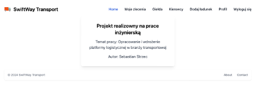

# Praca inżynierska

# OPRACOWANIE I WDROŻENIE PLATFORMY LOGI-STYCZNEJ W BRANŻY TRANSPORTOWEJ

## DEVELOPMENT AND IMPLEMENTATION OF A LOGISTICS PLATFORM IN THE TRANSPORT INDUSTRY

## Cel pracy

Celem pracy jest stworzenie aplikacji webowej, opracowanie, rozwinięcie i wdrożenie nowoczesnej platformy logistycznej,
której celem jest usprawnienie procesów re-zerwacji i monitorowania przesyłek. Projekt ten zakłada integrację
przewoźników, spedycji i klientów w spójny system,
poprawiając efektywność operacyjną.
Dodatkowo, konieczne jest wdrożenie całego systemu na hosting internetowy, aby umożliwić dostęp do aplikacji
użytkownikom z dowolnego miejsca.

## Rezpoytria

Praca składa sie z dwóch repozytoriów frond-endu i back-endu

https://github.com/zotthy/Logistic-Page.git

https://github.com/zotthy/LogisticApi.git

## Backend

Aplikacja serwerowa jest oparta o Spring Boot i realizuje podstawowe operacje CRUD
(Create, Read, Update, Delete). Architektura jest podzielona na 3 warstwy:
kontrolery, serwisy i repozytoria.


Opis warstw na przykładzie endpointu:

• Kontrolery są odpowiedzialne za obsługę żądań HTTP i zwracanie odpowiedzi z odpowiednim kodem.

• Serwisy zawierają logikę biznesowa są wywoływane przez kontrolery, są odpo-wiedzialne za wykonywanie operacji na
danych.

• Repozytoria są odpowiedzialne za bezpośrednią komunikacje z bazą danych.

## Frondend

Aplikacja frondendowa została napisana w JavaScript przy użyciu biblioteki React.JS




## Wdrożenie

### dockerfile

```
FROM maven:3.8.4-openjdk-17 AS build
COPY . /app
WORKDIR /app
RUN mvn clean package -DskipTests
RUN ls -la /app/target
FROM openjdk:17
COPY --from=build /app/target/*.jar /app.jar
RUN ls -la /app.jar
ENTRYPOINT ["java", "-jar", "/app.jar"]

```

### docker-compose

```
    services:
  mysql:
    container_name: bazadanych
    image: mysql:8.2.0
    ports:
      - "3306:3306"
    environment:
      MYSQL_DATABASE: 'db'
      MYSQL_USER: 'user'
      MYSQL_PASSWORD: '********'
      MYSQL_ROOT_PASSWORD: '********'

  app:
    container_name: SpringApp
    build:
      context: .
    ports:
      - "8080:8080"
    depends_on:
      - mysql
    environment:
      SPRING_DATASOURCE_URL: "jdbc:mysql://mysql:3306/db"
      SPRING_DATASOURCE_USERNAME: 'user'
      SPRING_DATASOURCE_PASSWORD: 'password'
```

### deploy frondend

```
cd ~/Logistic-Page/
git pull or git clone https://github.com/zotthy/Logistic-Page.git
npm run build
rm -r /var/www/html/*
cp -r dist/* /var/www/html/
```

### Uruchomienie na serwerze

```
git clone https://github.com/zotthy/LogisticApi.git
cd LogisticApi
docker compose up -d
./deploy-frontend.sh
```

### Adres wdrożonego systemu 188.254.50.113 


## Dalszy rozwój na magisterkę

•	Aplikacja mobilna

•	Inteligentne szukanie zleceń

•	Tracking przesyłek

•	Integracja z zewnętrznym system monitorowania czasu kierowcy

•	Możliwość tworzenia ładunku składającego się w większej ilości zleceń

•	Możliwość negocjacji ceny

•	Podpięcie pod bramkę płatniczą aby płacić za pośrednictwem strony

•	Możliwość dodawania recenzji na temat kierowcy


 


